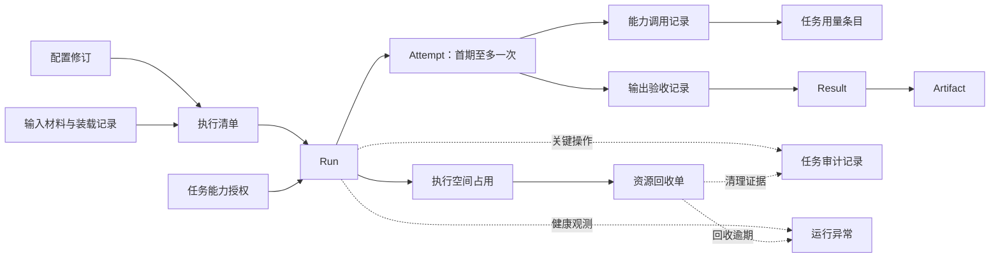

# AtomicAgent 领域模型

更新：2026-09-13。根据用户“完善领域建模，检查审计、监控完整性”的请求补充。已确认产品边界以 [需求基线](requirements-baseline.md) 为准；本文件定义对象、关系和不变量，术语定义见 [CONTEXT](../CONTEXT.md)。当前目录只有设计文档，没有运行实现可核对；下文是设计要求，不是现有代码行为。

## 1. 一个领域，四组职责

当前仍采用一个 AtomicAgent 领域，不为了审计或监控先拆微服务或多个限界上下文。

| 职责 | 拥有的事实 | 不应拥有的判定 |
| --- | --- | --- |
| 任务执行 | 接受、执行清单、授权、尝试、终态 | 不能根据网络断连判定业务取消 |
| 输出交付 | 输出检查、结果提交、产物可用性 | 不能根据 Agent 自述判定必需文件存在 |
| 资源回收 | 资源归属、删除意图、实际清理证据 | 不能覆盖已经提交的任务结果 |
| 运行保障 | 审计查询、健康观测、异常与处置 | 不能用告警确认或 trace 结束代替执行事实 |

“Agent 任务”表示调用方要完成的工作；“独立任务”是生命周期约束，二者不是需要再建两张表的实体。Run 承载一次接受后的执行身份。审计、事件、日志、指标是不同用途的信息，不能都归入一个无限扩展的 `logs` 对象。

## 2. 对象、身份与关系

| 对象 | 核心属性 | 归属和生命周期 |
| --- | --- | --- |
| Run | 调用方、提交身份、接受时间、总期限、状态、终止原因、结果引用 | 一次逻辑任务；终态后记录按 7 天保留 |
| InputObject / InputBinding | 所属调用方、源文件/产物身份、内容摘要、可用期限；本次 Run 授权、目标位置、装载结果 | 源材料与执行副本分开；只有合法、未过期且装载完整的输入可进入 Agent 执行 |
| ExecutionManifest | 输入身份/摘要、配置修订、实际 runtime/model、输出契约、有效限额 | 一个 Run 在准备完成后固定；固定前不能开始 Agent |
| CapabilityGrant | 调用主体、授权范围、策略修订、有效期、撤销记录 | 属于 Run；撤销是独立事实，不修改原授权依据 |
| ConfigurationRevision | 配置种类、身份、版本、内容摘要、启用状态、登记主体 | 修订内容固定；启用/停用有审计，不原地改写历史内容 |
| Attempt | Run、执行身份、启动意图/实际启动、结束原因、当前接管代次 | 首期一个 Run 最多一次 Agent 执行；未启动则可没有 Attempt |
| SandboxAllocation | 所属 Run、创建操作身份、provider 资源身份、用途、期望/观测状态 | 资源创建响应丢失时 provider 身份可能尚不明确；仍保留创建意图用于对账 |
| InvocationRecord | Attempt、调用身份、父调用、种类、目标、重试关联、状态、观测来源 | 记录模型/MCP/工具层能观察到的调用；不得冒充完整进程行为追踪 |
| UsageEntry | 调用或 Attempt、来源、单位、值、计量范围、完整度、观测版本 | 归一化汇总到 Run；延迟账单可补记，不重写原始观测 |
| ValidationReport | 验证器/规则版本、被验收输出摘要、逐项要求及结果 | Result 的提交依据；测试通过与开放研究内容正确性分别表达 |
| Result | Run、结构化值、摘要、ValidationReport、产物清单 | 至多一份已提交成功结果；失败可有独立诊断摘要 |
| Artifact | Run、对象身份、大小/类型/摘要、可用状态、保留期限 | 转存后与 sandbox 分离；清单按 7 天保留，文件 24 小时 |
| CleanupObligation | Run 或资源归属、待回收目标、期限、执行与核验证据 | 责任独立于 Run 终态；即使创建阶段失败也必须回收已产生资源 |
| AuditRecord | 操作主体/发起方、动作、目标、授权/清单版本、结果、证据来源 | 控制面产生的责任事实；在保留期内追加，不用日志修改代替纠正记录 |
| HealthObservation / OperationalIncident | 范围、观测时间、异常条件、责任者、确认/恢复事实 | 运行保障对象；并非新的业务 Run 或人工等待会话 |

关系：

同一 Run 可因环境准备或不确定的创建响应关联多个资源记录，但同一时刻最多一个获准的 Agent 执行空间。多余或失败准备资源必须回收。首次启动响应未知时，先核实原执行，不能当作“没有启动”再开一次。

## 3. 关键不变量

| 编号 | 不变量 |
| --- | --- |
| DM-01 | 请求重发不是新任务；同一幂等身份只绑定一个 Run，新的业务重做创建新 Run。 |
| DM-02 | 准备重试不是 Agent Attempt；接管同一进程不是新 Attempt；首期不因失败自动新增 Agent 执行。 |
| DM-03 | 固定执行清单包含实际采用的配置版本，不能仅保存请求中的 `latest` 或配置 ID。 |
| DM-04 | 已请求、已装载、可调用、实际调用是不同事实。Skill 可见并不证明它被使用；有使用要求时需额外证据。 |
| DM-05 | 权限由平台与受控服务执行；Agent 输出中的 actor、policy、success 字段不能提升为可信授权或终态。 |
| DM-06 | 一个 Run 只有一个已提交终态；旧 worker、重复事件和迟到取消不能覆盖它。 |
| DM-07 | Result 提交依赖验证通过和必需产物转存；监控系统不可替代提交依据。 |
| DM-08 | 任务成功、产物可用、资源已回收分别成立；不能用一个 success 布尔值覆盖三者。 |
| DM-09 | 不确定的资源观测不能当作已删除。权限错误、超时、列表不完整与“确认不存在”分别处理。 |
| DM-10 | 未知用量不填零，累计快照与增量不能混加，同一消费不把 SDK 估计和供应商账单相加。 |
| DM-11 | 审计主体来自鉴权与受控执行身份；未认证请求可以留下拒绝记录，但不能信任它自报的调用方身份。 |
| DM-12 | 任务、审计和产物保留不能造成未结束的资源回收责任无主。过期数据与待处置资源定位信息分别管理。 |

## 4. 事件的来源和可信范围

| 来源 | 可以证明 | 不能单独证明 |
| --- | --- | --- |
| API 鉴权/配置登记 | 谁提交、谁修改或停用哪版配置、是否获准 | 实际使用了所有请求能力 |
| 平台执行适配与权限边界 | 发起了哪些受控动作、工具权限检查结果 | 内核级全部行为或不可见的模型内部调用 |
| Agent 自述或原生消息 | Agent 报告了某个状态/内容 | 产物已持久化、系统已回收、业务事实正确 |
| 平台输出验收器 | 声明的 schema/文件/断言检查结果 | 未定义的语义要求也已满足 |
| 资源 API 的完整新鲜观测 | 对当前授权范围内资源的存在/状态判断 | 失败查询代表没有资源 |
| 监控采集器 | 指定时间/范围内观测到的健康数据 | 未采样事件从未发生、采集失联时仍健康 |

对无法观察的调用显式记 `coverage=partial/unknown`。若某条产品承诺要求完整工具或出站访问审计，该路径必须经不可绕过的受控边界，或在接入验证时判定不满足；不由一条 hook 注册成功推定完整覆盖。

## 5. 生命周期与竞争场景

### 输入材料与配置

输入先完成上传/内容验证，才能作为可用材料引用。Run 在准备期间解析并装载固定输入；源材料过期、权限撤销或复制不完整时明确准备失败，不能装载当前碰巧存在的同名文件。进入执行前形成任务专属副本，源对象与任务副本分别履行自己的清理责任。

前次产物作为新任务输入需要新的显式引用和权限检查；形成新任务副本后，原产物仍按原保留期过期，新副本受新任务期限与清理约束。这是一次新的输入使用，不是偷偷续期原产物或跨任务继承会话。

配置登记产生固定修订；默认停用表示不再接纳使用该修订的新任务，已有 Run 的执行依据不随之改写。需要立即收回运行中能力时，执行显式的授权撤销/任务终止流程，记录操作者、影响范围和实际停止证据。具体维护命令属于实施规格，不允许以改写旧配置内容取代这两种不同操作。

### Run 与资源回收

任务到终态时，回收责任也必须已可靠登记。准备阶段失败产生的临时资源同样有回收单，不能等待一个永远不会启动的 Attempt。

回收责任的候选阶段为 `pending → executing → verifying → complete`；失败可重试或进入需处置状态。`complete` 要包含目标身份、核验来源、时间和结果。API 的 `cleanup_status` 是这些责任的汇总视图。

需要清理的范围包括进程、任务工作目录、临时配置/会话、运行凭据的有效能力与归本任务所有的暂存对象。共享输入或前次产物仍按自身授权和保留期管理，不能被任意引用它的任务删除。

### 调用与用量

能力调用区分 `requested/denied/started/completed/failed/unknown`。平台已发送调用但没有回执，不能记为明确未执行；即使允许阶段重试，也保留每次实际尝试的用量和未知消费。

每个用量观测标注：增量还是累计、对应何种调用范围、是供应商报告还是平台估计、计量单位和完整程度。累计值按来源版本替换汇总基准，不再次累加全部历史值。模型重试、辅助调用和可观察的子 Agent 用量计入同一 Run 的限制。

### 告警确认与恢复

异常条件满足时产生运行异常；操作者可以确认已接手，但确认不意味着故障恢复。恢复需要新鲜证据证明触发条件消失；采集器失联则健康状态转未知，不自动恢复告警。

## 6. 五个用于检验模型的反例

1. **任务成功但容器删除失败。** Result 保持成功；CleanupObligation 未完成；产生回收逾期异常。人工确认告警不能把资源改成已删除。
2. **第八天发现孤儿资源。** 任务正文和常规审计已过期，仍需有最小资源归属和未完成责任用于回收；不能通过延长全部原始对话保留解决。该最小保留例外已获用户确认，核验完成后 7 天删除，见审计监控规格及 ADR 0006。
3. **同名 MCP 配置已改版。** 老 Run 使用固定修订和授权；新配置停用/安全撤销需要显式动作，不能让老任务的审计依据随文件更新漂移。
4. **进程还在输出，但没有业务进展。** stdout 活跃只能说明有输出；分别观测 worker 存活、执行存活、阶段推进和总期限。不能凭日志活跃无限延长任务。
5. **Agent 输出了一条“审计通过”。** 只能作为不可信内容；平台授权、验证和资源事实由对应权威来源产生，不能从 stdout 直接导入审计 actor 或终态。

详细审计事件、监控指标、访问权限与故障验收见 [审计与监控规格](audit-monitoring.md)。
