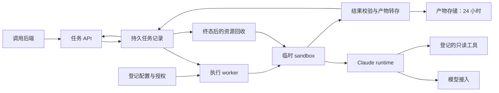

# AtomicAgent 调研综合：一次请求的任务执行平台

研究日期：2026-09-12，2026-09-13 补充 Sandcastle 源码对比。本文综合第一方文档与源码研究；没有安装运行候选项目，也没有性能、成本或隔离验收结论。需求决策以 [当前需求基线](../requirements-baseline.md)、[访谈记录](../interview-log.md) 和已接受 ADR 为准。

## 产品判断

**建议将产品定位为“由 coding agent 驱动的独立任务执行 API”。** 对调用后端，一次提交描述目标、输入材料、可用能力与结果要求；平台负责将它变成一个受约束、可观测、有结果交付记录的任务。Agent 内部可以多轮调用模型、读写文件、执行程序、访问工具。

这个构想的执行引擎部分已有直接技术基础：Claude 官方部署文档描述每任务创建并销毁执行环境的 ephemeral 模式，任务也可以是资料提取、翻译、媒体转换。真正需要 AtomicAgent 明确的是任务的身份、权限、预算、结果判定和回收契约。[Claude Hosting](https://code.claude.com/docs/en/agent-sdk/hosting)

“放大”应按业务任务衡量：相同输入和目标下，比较普通模型调用与任务执行服务的正确率、可交付产物、耗时和成本。平台能让模型使用额外计算、文件和工具，不意味着每项任务都会更快、更便宜或更准确。首期选定的文件处理与研究任务分别验证计算和产物能力、外部证据与工具能力。

## 已确认的产品边界

| 事项 | 当前结论 |
| --- | --- |
| 调用方 | 自有后端服务 |
| 首期引擎 | Claude；Qwen 模型连接的套餐与兼容性单独核实 |
| 任务样例 | 文件处理 + 资料研究，均覆盖 |
| 执行能力 | 已登记的环境、Skills、MCP 按请求组合 |
| 外部行为 | 首期外部业务资源只读；任务内可写文件 |
| 跨任务状态 | 独立任务，无自动会话继承 |
| 客户端断连 | 任务可以继续，终态后回收 sandbox |
| 产物 | 独立转存，保留 24 小时 |

## 最值得借鉴的项目，各自解决什么

| 层次／候选 | 已核实事实 | 对本项目的研究建议 |
| --- | --- | --- |
| Claude Agent SDK | 提供 Claude Code 的 agent loop、工具和上下文管理；支持程序化执行 | 按用户选择作为首期执行引擎，验证实际模型连接与结果协议。[官方概览](https://code.claude.com/docs/en/agent-sdk/overview) |
| OpenSandbox | Apache-2.0，统一生命周期／执行 API，Docker 和 Kubernetes 后端，可接更强隔离 runtime | 优先验证其自托管任务执行接口；不用自行从零造 sandbox 生命周期服务。[官方仓库](https://github.com/opensandbox-group/OpenSandbox) |
| E2B runtime | Firecracker microVM、模板快照恢复，分离控制平面和执行节点 | 研究独立内核隔离和低延迟准备；具体自托管开放能力、成本另行验证。[架构源码](https://github.com/e2b-dev/runtime/blob/main/docs/ARCHITECTURE.md) |
| OpenHands SDK／agent-server | Conversation、remote workspace、HTTP/WebSocket 分层；agent-server 自述面向开发、测试和轻量部署 | 学习任务控制与执行空间分离；不能当作已经满足本平台全部可靠性的通用宿主。[源码 README](https://github.com/openhands/software-agent-sdk/blob/main/openhands-agent-server/openhands/agent_server/README.md) |
| OpenCode、Pi、Codex | 有程序化入口，能力形状不同；Pi 核心不内置 MCP | 作为接口设计对照。用户已固定 Claude，首期不需要用多引擎集成验证完成度。[引擎研究](01-agent-runtimes.md) |
| Daytona、Modal | Daytona 旧仓库公告核心已迁私有；Modal 本次核实开源的是 SDK | 用作托管 API 与开发体验对照，区分托管能力和可自托管源码。[Daytona 公告](https://github.com/daytonaio/daytona)、[Modal SDK](https://github.com/modal-labs/modal-client) |

## 建议的职责划分

下图表达已逐轮确定的职责方向，不是已部署架构。选型见 [OpenSandbox + Claude SDK ADR](../adr/0005-opensandbox-with-claude-sdk.md)，具体协议形状见 [API 合约](../task-api-contract.md)。

- **任务 API 和任务记录**：维护任务身份、提交去重、状态和交付结果；不以连接存活表示任务存活。
- **worker 和 sandbox**：准备环境、运行进程、执行资源和网络限制；环境准备成功与任务执行成功分开。
- **Claude runtime**：规划、模型循环、工具选择、上下文管理；原生事件是平台判定的输入之一。
- **结果校验和产物存储**：验证输出契约、转存文件、提交可取回结果。Claude `success` 仍可能缺少结构化值，平台必须检查。[结构化输出说明](https://code.claude.com/docs/en/agent-sdk/structured-outputs)
- **资源回收**：任务终态后回收进程、环境和任务配置；回收失败需要独立可观测记录，不能重做已经完成的业务任务。

## 应采用的设计理念

1. **声明式输入，明确有效配置。** 请求表达目标和所需能力；平台解析出固定版本的执行配置。环境、Skills、MCP 被请求、被装载、可调用和实际使用是不同事实。
2. **任务、尝试、会话、sandbox 各有身份。** 将内部 agent 会话直接变成公共 API，会把引擎差异和环境恢复承诺带给调用方。当前任务独立边界允许把会话留在执行内部。
3. **终态以结果交付为依据。** 文本声称完成、进程退出、JSON 合法、产物已转存、业务断言正确，需要分别记录。
4. **先固定版本，再讨论可重现性。** 固定输入摘要、镜像、Skills、MCP、CLI、SDK、模型 ID 能提高可追溯性；不保证随机模型或变化网页产生相同输出。
5. **可靠性按故障边界设计。** 产物上传失败可重试上传，清理失败可重试清理；不应都重跑 agent。即使用 Temporal，下游副作用也需要幂等设计。[Temporal Activity](https://docs.temporal.io/activity-definition)
6. **协议按层使用。** ACP 可参考内部 agent 控制，A2A 可参考任务互操作，MCP 接工具与上下文；首期自有后端无需为了“标准化”先实现全部协议。[协议研究](03-execution-contracts.md)
7. **优化真实端到端路径。** 拆分排队、准备、模型执行、产物收集；只有准备占比值得优化时再引入预热。若采用预热，优先领取无用户数据的实例，用过即销毁，而非回池。

## Claude 与 Qwen 的专项结论

阿里云提供 Claude Code 接 Qwen 的 Anthropic 兼容配置；Anthropic 表明其不支持经 gateway 路由到非 Claude 模型。这里能支持的结论是“有兼容接入路径，需固定版本实验”，不能推导 SDK 全能力等价。[阿里云接入](https://help.aliyun.com/zh/model-studio/claude-code)、[Anthropic Gateway](https://code.claude.com/docs/en/llm-gateway)

当前 Token Plan 个人版、团队版 FAQ 明确排除自动化脚本和应用后端用途。建议将模型接入登记独立于 runtime，评估 Qwen 按量 API 进行自动化实验；这是建议，不是已替用户变更的账户或模型配置。[个人版 FAQ](https://platform.qianwenai.com/docs/token-plan/personal/token-plan-personal-faq)、[团队版 FAQ](https://platform.qianwenai.com/docs/token-plan/team/token-plan-team-faq)

## 2026-09-13 补充：Sandcastle 的层次与适用范围

用户要求进一步比较 Matt Pocock 的 Sandcastle。它是 `@ai-hero/sandcastle` TypeScript 编排库，提供 agent 调用和 sandbox provider，主要工作流围绕 Git、worktree、分支与提交。它已有结构化输出和取消接口，不能简单归类为只有 CLI 的小工具。[官方 README](https://github.com/mattpocock/sandcastle)

**当前建议仍是 OpenSandbox 作为执行空间底座，Claude Agent SDK 作为 Agent 接口，AtomicAgent 自己管理 Run 和结果合约。** 理由是当前首批任务以通用文件和研究产物为中心，不需要代码分支、提交合并与会话恢复；Sandcastle 的高层便利性包含这套仓库工作流，需要额外适配才能符合本项目边界。

源码还显示 Sandcastle 默认捕获 Claude 会话，Docker 资源参数有 CPU、未见内存限额字段，删除函数忽略 stop/rm 错误。它们分别涉及记录保留、4 GiB 实验上限和清理状态证明；不是宣称项目无法清理或无法扩展，而是不能直接沿用默认行为作为本平台承诺。[固定版本 AgentProvider](https://github.com/mattpocock/sandcastle/blob/e99f832f26dc9d245c019a9ddd19fa5dee792427/src/AgentProvider.ts)、[固定版本 DockerLifecycle](https://github.com/mattpocock/sandcastle/blob/e99f832f26dc9d245c019a9ddd19fa5dee792427/src/DockerLifecycle.ts)

如果未来首要场景转为修改代码仓库、并行分支、自动审查与合并提交，Sandcastle 的高层编排会更有直接价值。当前建议不否定其项目质量，也不将 OpenSandbox 视为已经具备本平台的持久任务、幂等与产物保留。

## 进入实现前最有价值的验证

- Claude + 选定 Qwen endpoint：文件读写、工具循环、结构化结果、只读 MCP、取消与 token 用量；不能只测一条问候语。
- 完整生命周期：初始文件和配置装载 → agent 执行 → 校验 → 产物提交 → 终态 → sandbox 销毁 → 销毁后仍可下载。
- 失败闭环：提交响应丢失、worker 重启、模型限流、格式失败、上传失败、清理失败、取消与完成竞争。
- 独立性与限制：跨任务文件和配置隔离、禁止外部业务写入、CPU/内存/时间/文件限制的实际生效。
- 两类业务样例：文件统计值和输出内容有确定断言；研究报告可核对来源和结论对应关系。

## 专项报告

- [01 Coding agent 接口、许可证据与适配差异](01-agent-runtimes.md)
- [02 Sandbox 项目、隔离底座与自托管取舍](02-sandbox-platforms.md)
- [03 任务协议、状态、幂等、取消与可靠执行](03-execution-contracts.md)
- [04 Claude + Qwen 接入与 Token Plan 使用边界](04-claude-qwen-compatibility.md)
- [05 OpenSandbox 与 Sandcastle 的固定版本源码比较](05-opensandbox-vs-sandcastle.md)
